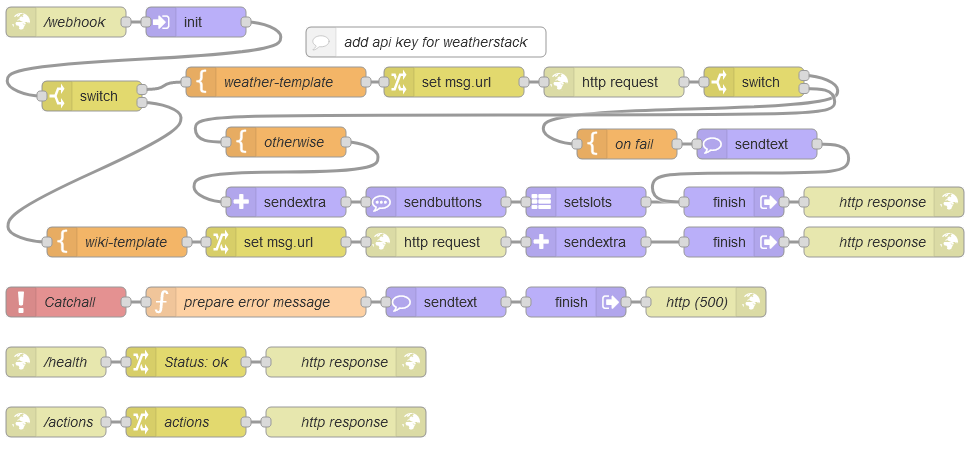

# RasaasDemo

This Node-Red flow implements an action server for a Rasa chatbot. 
It requires a Node-Red installation including  ``node-red-contrib-rasa-actionserver`` (``rasaas``).
It can execute custom actions for a slightly extended version of the weatherbot of  https://github.com/JustinaPetr/Weatherbot_Tutorial.
You can ask the bot for weather informaton for a specific location, and you can ask  for more info about a  location.
The weather bot will call the action server which will access weatherstack api or wikipedia api, depending on the user intent. 
You need to provide a valid access key for weatherstack api in the flow.

## Endpoints
### webhook
The main flow starts at /webhook; it branches into two actions.
- Action_weather calls weatherstack api
- Action_more calls wikipedia api

The flow demos the use of the rasaas nodes. ``setslots`` node is not needed at all, but included into the flow for demoing its usage.

### health
sends back status ok

### actions
sends back the list of supported actions. The actions have to be entered manually in the node.

### Catchall
catches errors and reports the error message to Rasa. Returns HTTP status code 500.

## Try it out
### Chatbot data
Data and config files for a very preliminary version of the weather chatbot are provided, which you may use for training the chatbot.

### Test it manually with postman 
Two sample requests are provided for manual testing of the action server with Postman.